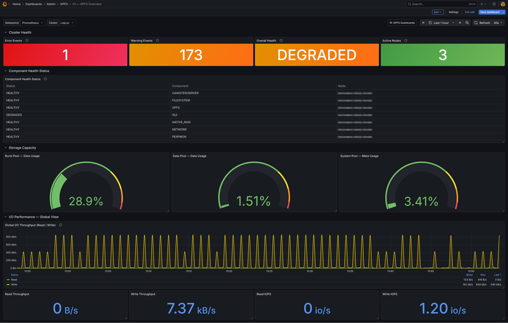
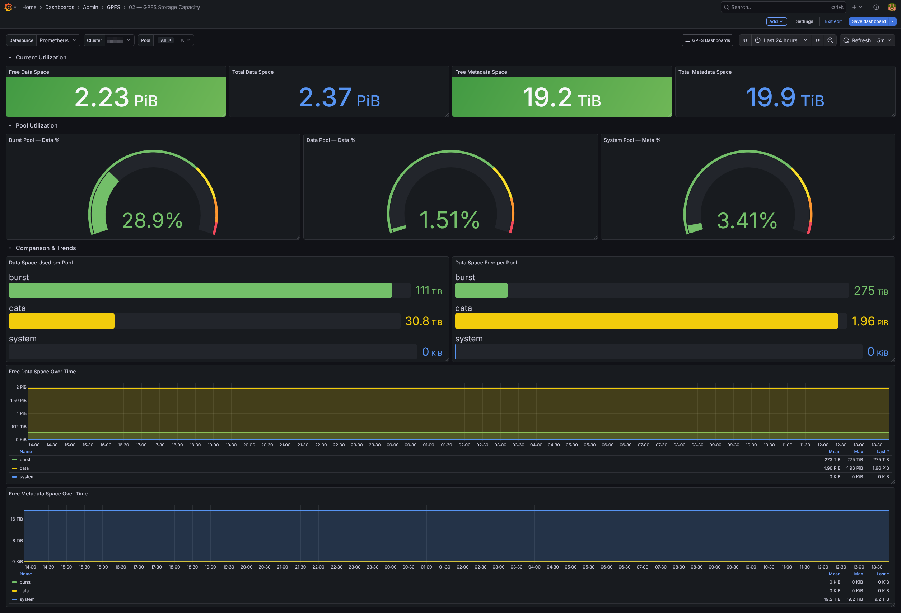
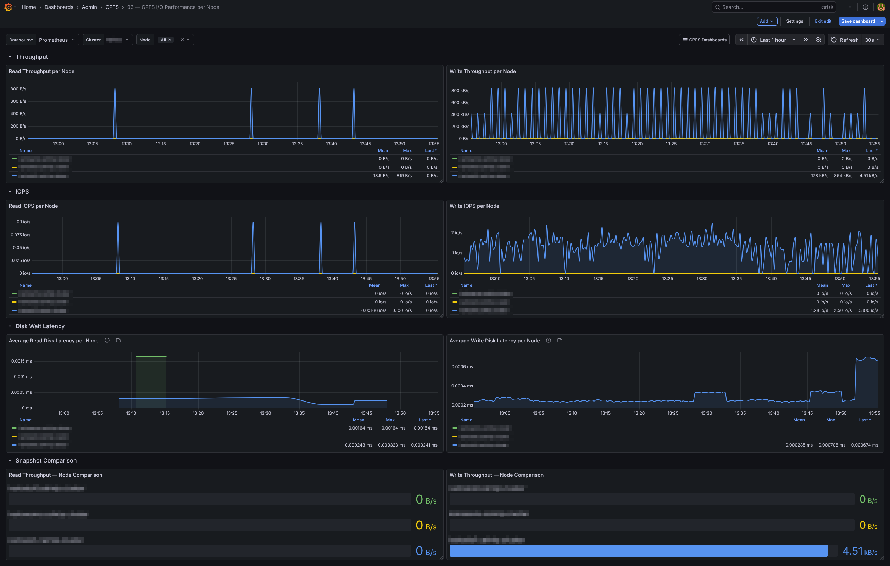
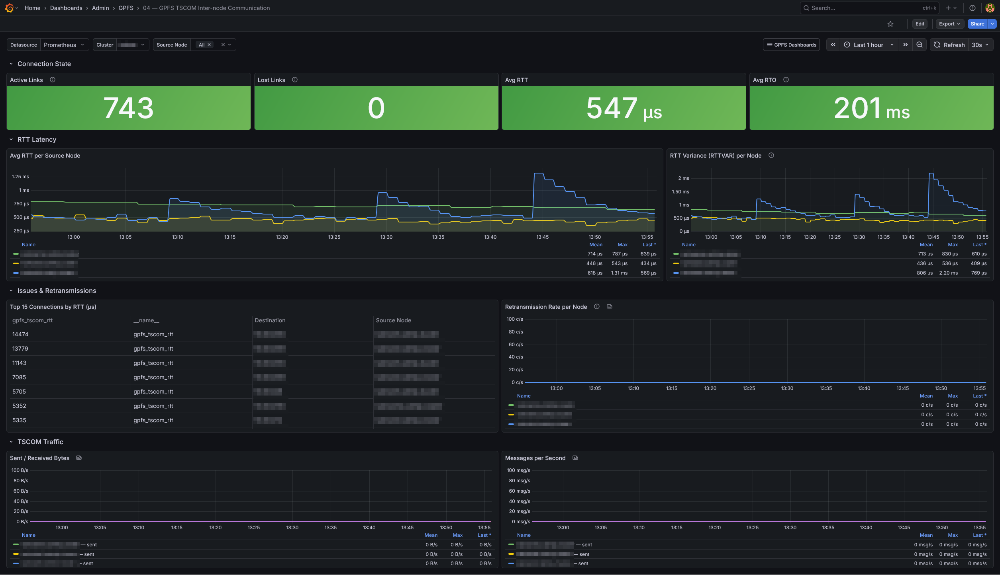
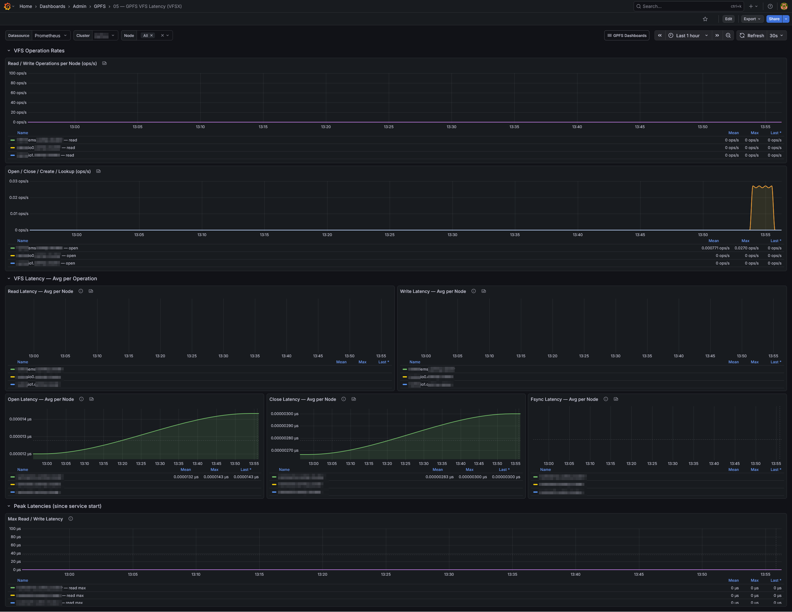
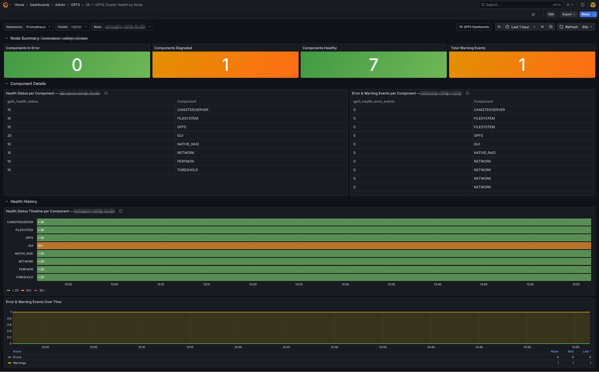

# Grafana Dashboards for IBM Spectrum Scale (GPFS)

A set of production-ready Grafana dashboards for monitoring IBM Spectrum Scale (GPFS) clusters, built on top of the [ibm-spectrum-scale-bridge-for-grafana](https://github.com/IBM/ibm-spectrum-scale-bridge-for-grafana) exporter.

## Dashboards

| | | |
|:---:|:---:|:---:|
| **01 — GPFS Overview** Cluster-wide health summary, throughput and capacity at a glance | **02 — Storage Capacity** Per-pool usage (data, burst, system), free/used space trends | **03 — I/O Performance per Node** Read/write throughput, IOPS and disk latency per node |
|  |  |  |
| **04 — TSCOM Communication** Connection status, RTT, retransmits and bandwidth between nodes | **05 — VFS Latency (VFSX)** Per-node VFS call latency (read, write, open, lookup, readdir…) | **06 — Cluster Health by Node** Per-component health status (GPFS, FILESYSTEM, NETWORK, NATIVE_RAID…) |
|  |  |  |

All dashboards are linked together via a **"GPFS Dashboards"** navigation group.

## Requirements

- **Grafana** ≥ 10.x
- **Prometheus** datasource
- **IBM Spectrum Scale bridge exporter** — [ibm-spectrum-scale-bridge-for-grafana](https://github.com/IBM/ibm-spectrum-scale-bridge-for-grafana)

## Import

1. In Grafana, go to **Dashboards → Import**
2. Upload the desired `dashboard_*.json` file
3. Select your Prometheus datasource
4. Repeat for each dashboard

## Template variables

Each dashboard exposes the following variables, auto-populated from Prometheus labels:

| Variable | Scope |
|----------|-------|
| `$cluster` | All dashboards |
| `$node` | Per-node dashboards (03, 04, 05, 06) |
| `$pool` | Capacity dashboard (02) |

## Metrics

Dashboards rely on the following Prometheus jobs exported by the bridge:

| Job | Coverage |
|-----|----------|
| `GPFSmmhealth` | Cluster health status per component |
| `GPFSPool` | Storage pool capacity |
| `GPFSFilesystem` | Filesystem-level I/O stats |
| `GPFSNode` | Per-node I/O stats |
| `GPFSTSCOM` | Inter-node communication stats |
| `GPFSVFSX` | VFS extended call stats and latency |
